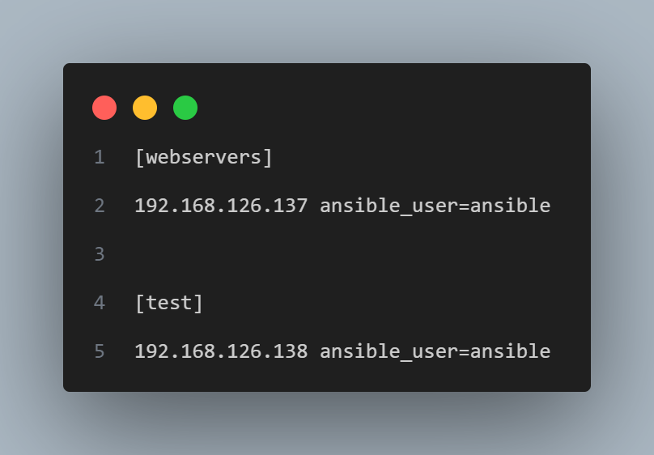
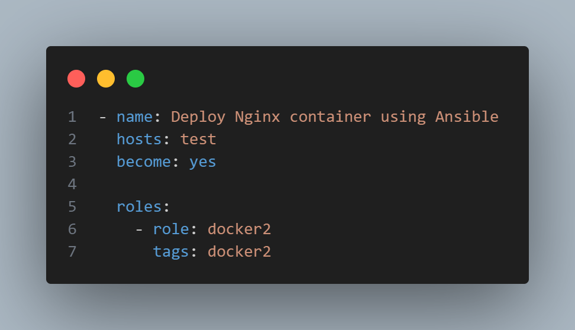
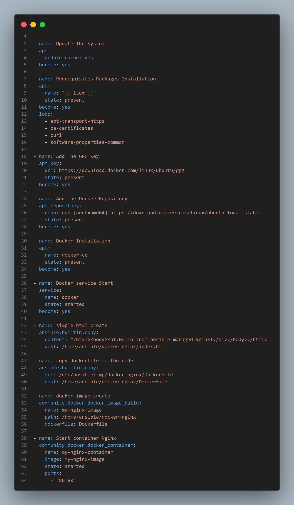
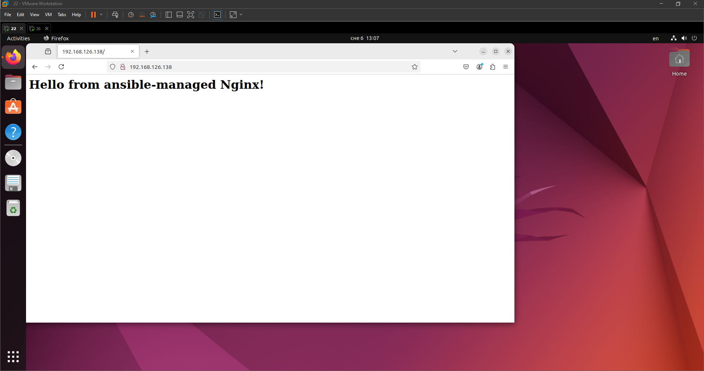

<h1 align="center"> Задание:</h1>

 Инфраструктура:

    Развернуть контейнер с Nginx для обслуживания простой HTML-страницы. При этом должен быть использован Docker-file, в котором будут будут производится все необходимые шаги по сборке образа. Запуск контейнера на базе образа осуществляется через Docker CLI.
 
Ansible: ***

     Написать, используя роли, Ansible playbook, который выполнит следующие задачи:
    • Установит Docker на целевую ноду.
    • Развернет Nginx-контейнер с использованием Docker.
    • Копирует HTML-файл (веб-приложение) в контейнер Nginx.
    Docker:
    • Nginx-контейнер должен работать в фоновом режиме.
    • Порт 80 контейнера должен быть проброшен на хостовую машину.
    Проверка:
    • После выполнения плейбука веб-приложение должно быть доступно через браузер по порту 80 хостовой машины.
    • разместить контейнер в docker network (Ansible***)
    • файл для Nginx разместить в docker volume (Ansible***)
    
<h1 align="center"> Выполнение:</h1>

1. Создаю host файл, в котором описываю ноду на которую буду ставить Docker с контейнером nginx. В данном случае это будет:  

        [test] 192.168.126.138 ansible_user=ansible

    

2. Создаю docker_2.yml файл, с котрого буду запускать плейбук, -расположенный в роли Docker2.
   

3. Создаю директорую tmp/docker-nginx, в которую помещею Dockerfile, и тестовую страничку index.html, которые в будущем будут скопированы на ноду в nginx контейнером. 
    
    Так выглядит Dockerfile:

        FROM nginx:latest
        VOLUME /usr/share/nginx/html
        COPY index.html /usr/share/nginx/html/index.html
        EXPOSE 80
        CMD ["nginx", "-g", "daemon off;"]
    Здесь я устанвливаю nginx с официального образа, создаю volume и помещаю туда тестовую страницу html, сообщаю о том, что контейнер будет слушать 80 порт, запускаю nginx в бэкграунд режиме.

4. Создаю docker2.yml в /etc/ansible/roles/docker2/tasks, в котром описываю, что будет происходить при запуске playbook docker_2.yml в корневой папке Ansible.
    
    
    Сначала обновляю данные репозитория на ноде, далее устанавливаю все необходимые зависимости для Docker и сам Docker.
    После этого убеждаюсь, что Docker запущен.
    Копирую нашу html страничку и Dockerfile на ноду.
    Из Dockerfile создаю dockerimage, из которого стартую nginx container, в свою очередь в котором открываю 80-й порт.
    
            В результате запускаю docker_2.yml командой ansible-playbook docker_2.yml
     При переходе из хостовой машины на ноду по 80-му порту получаю результат: 
    