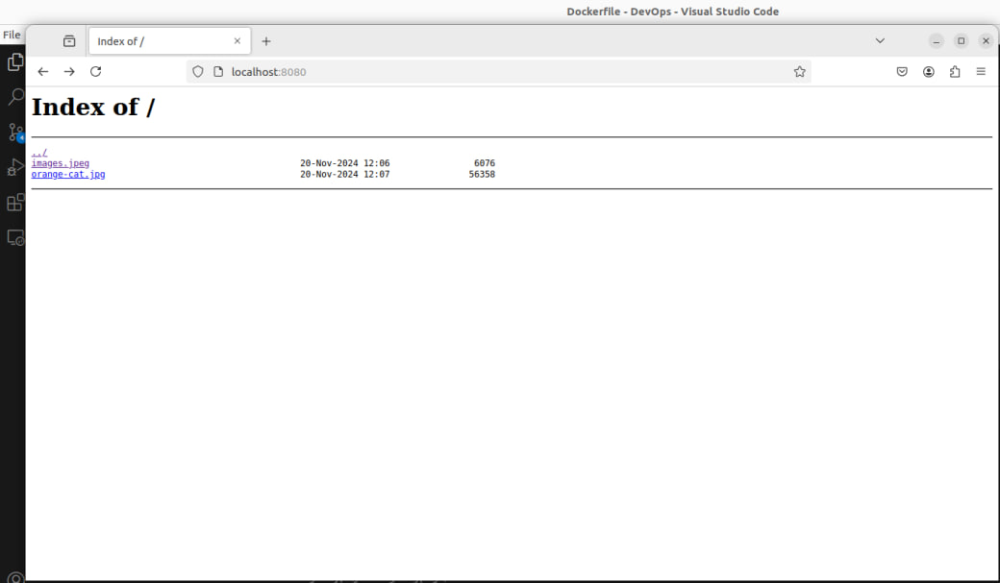

<h1 align="center"> Задание:</h1>

Создание Dockerfile для приложения веб-сервера.

Вам необходимо написать Dockerfile для создания контейнера с приложением
веб-сервера на основе образа Ubuntu 20.04. Приложение должно быть
запущено на порту 8080 и должно отдавать статические файлы из каталога
/app/static.
Шаги, которые необходимо выполнить:
1. Создайте новый файл Dockerfile в пустой директории на вашем
локальном компьютере.
1. Напишите инструкцию FROM, которая указывает базовый образ
Ubuntu 20.04.
1. Установите необходимые зависимости с помощью инструкции RUN.
Установите пакеты nginx и curl, а также создайте каталог /app/static.
1. Скопируйте файл конфигурации nginx из вашего локального каталога
внутрь контейнера с помощью инструкции COPY.
1. Скопируйте статические файлы из каталога /app/static на вашем
локальном компьютере внутрь контейнера с помощью инструкции COPY.
1. Используйте инструкцию EXPOSE для открытия порта 8080.
2. Используйте инструкцию CMD для запуска команды nginx с указанием
пути к файлу конфигурации, который вы скопировали на шаге 4.
1. Сохраните файл Dockerfile и соберите образ с помощью команды docker
build.
1. Запустите контейнер из образа с помощью команды docker run и
проверьте, что веб-сервер отдает статические файлы из каталога /app/static на
порту 8080.

 <h1 align="center"> Выполнение:</h1>

 1. Создаю Dockerfile, в котором, за основу взята Ubuntu 20.04. 
    
        FROM ubuntu:20.04
        RUN apt-get update && apt-get install nginx -y && apt-get install curl -y
        RUN mkdir -p /app/static
        COPY custom.conf /etc/nginx/
        COPY /app/static /app/static
        EXPOSE 8080
        CMD ["nginx", "-g", "daemon off;", "-c", "/etc/nginx/custom.conf"]
    
    Далее с помощью инструкции RUN обновляюся репозитории и устанавливаются nginx и curl. 

    Далее создаются папки app/static. 

    С помощью инструкции COPY копируется наш файл custom.conf в /etc/nginx контейнера.

    Содержимое локального /app/static копируется в созданные ранее /app/static в контейнере.

    Устанавливаем порт 8080 на прослушивание с помощью инструкции EXPOSE.

    С помощью инструкции CMD запускаем nginx в контейнере в фоновом режиме и указываем како conf файл использовать.

2. Далее необходимо забилдить образ командой
   
        docker buld -t nginx:latest .
    в которой -t nginx:latest дает название образу, а точка означает, что билдить нужно из dockerfile, находящегося в этой директории.
3. Далее запускаю контейнер коммандой:
   
        docker run -p 8080:8080 nginx:latest

    В которой флаг -p позволяет открывает внутренний порт 8080 на внешний 8080 и мы можем достучаться до контейнера.
    
    В результате получаем:
    

