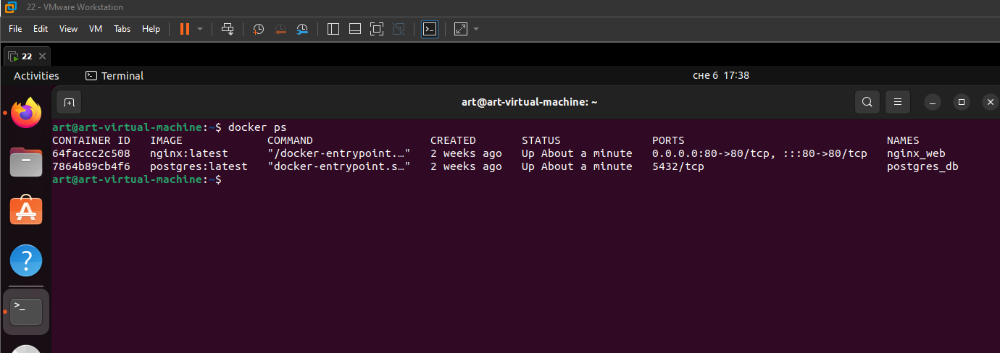
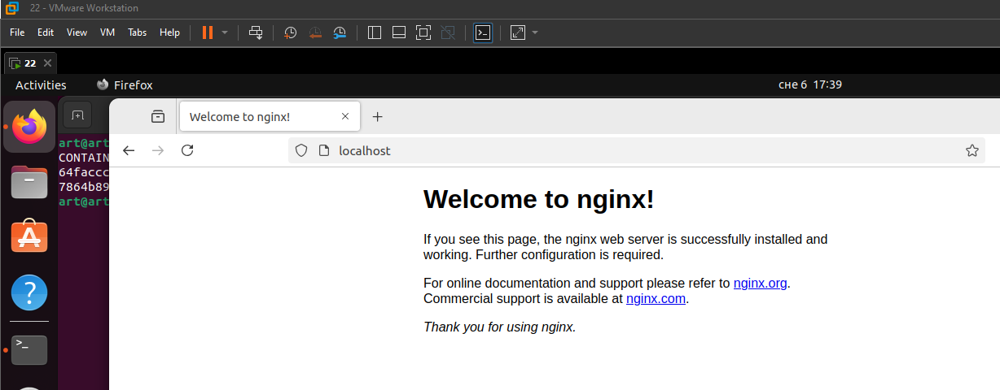

<h1 align="center"> Задание:</h1>

Развертывание приложения с помощью Docker-compose
Шаги, которые необходимо выполнить:
1. Создайте новый файл docker-compose.yml в пустой директории на
вашем локальном компьютере.
2. Напишите инструкцию version в версии 3.8.
3. Определите сервис для базы данных PostgreSQL. Назовите его ""db"".
Используйте образ postgres:latest, задайте переменные окружения
POSTGRES_USER, POSTGRES_PASSWORD и POSTGRES_DB для
установки пользовательского имени, пароля и имени базы данных
соответственно.
4. Определите сервис для веб-сервера на основе образа NGINX. Назовите
его ""web"". Используйте образ nginx:latest. Определите порт, на котором
должен работать сервер, с помощью инструкции ports. Задайте путь к
файлам конфигурации NGINX внутри контейнера, используя
инструкцию volumes.
5. Определите ссылку на сервис базы данных в сервисе веб-сервера.
Используйте инструкцию links.
6. Сохраните файл docker-compose.yml и запустите приложение с
помощью команды docker-compose up.
7. Проверьте, что приложение работает, перейдя в браузере на localhost:80.

 <h1 align="center"> Выполнение:</h1>
Создаю docker-compose.yml

    version: '3.8'

    services:
     db:
        image: postgres:latest
        container_name: postgres_db
        environment:
            POSTGRES_USER: myuser
            POSTGRES_PASSWORD: mypassword
            POSTGRES_DB: mydatabase
        volumes:
            - db_data:/var/lib/postgresql/data

    web:
        image: nginx:latest
        container_name: nginx_web
        ports:
            - "80:80"
        volumes:
            - ./nginx-conf:/etc/nginx/conf.d
        links:
            - db

    volumes:
    db_data:
В котором указываю версию 3.8 и описываю два сервиса.

Сервис db:

    Первый сервис db, в котром указываю, что нужно брать образ postgres:latest с докерхаба, указываю имя контейнера postgres_db.
    Далее задаю глобальные переменные и volume db_data:/var/lib/postgresql/data

Сервис web:

    Второй сервис web, в котором указываю, что нужно брать образ nginx:latest с докерхаба, указываю имя контейнера nginx_web.
    Пробрасываю внутренний порт 80 на внешний 80.
    Создаю volume ./nginx-conf:/etc/nginx/conf.d
    Определяю линку к сервису db.

Запускаю docker-compose.yml командой:

    docker-compose up -d

Далее проверю какие контейнеры поднялись

В конечном итоге запускаю браузер и проверю localhost:80

