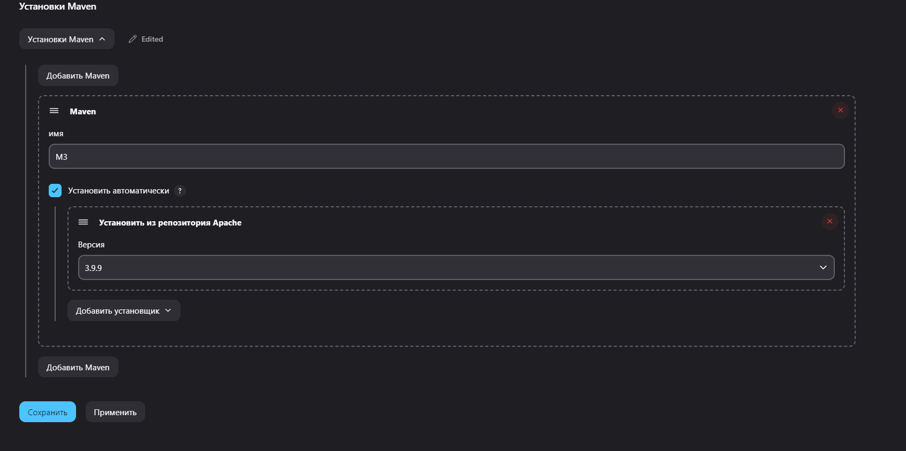
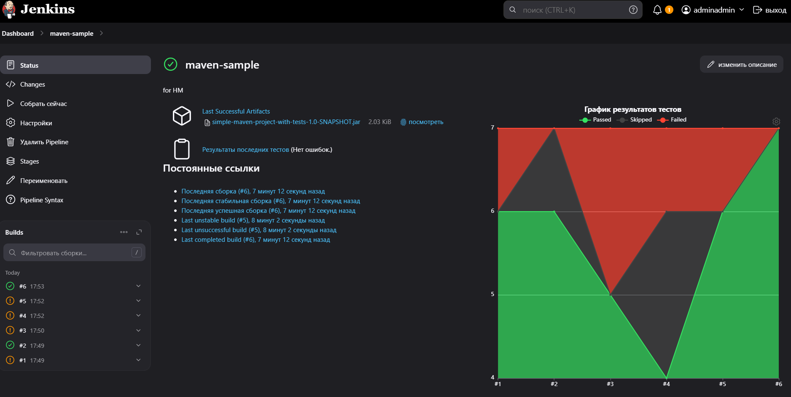

<h1 align="center"> Задание:</h1>

1. Установите и настройте агента Jenkins на удаленном компьютере.
Используйте официальную документацию Jenkins для выполнения
этого шага.
2. Создайте pipeline на основном сервере Jenkins, который будет
использовать агента Jenkins для выполнения сборки вашего тестового
проекта. Укажите метку агента, на котором сборка должна
выполняться.
3. Добавьте несколько шагов сборки в ваш pipeline, таких как скачивание
кода проекта из репозитория, компиляция, тестирование и
развертывание (используйте пайплайн из телеграма, если не найдёте какой-то свой). Используйте синтаксис Freestyle project или Pipeline в зависимости от вашего предпочтения. Настройте отчеты о
выполнении задачи в вашем pipeline.
4. Используйте интегрированные возможности отчетности Jenkins, такие
как JUnit, HTML Publisher или другие плагины, чтобы получать
информацию о статусе сборки и результате тестирования.
5. Настройте безопасность агента Jenkins, включая аутентификацию и
авторизацию. Необходимо сгенерировать ключ для Дженкинс, также создать все папки для пользователя jenkins на ноде, Host Key Verification Strategy = known hosts file. Укажите необходимые настройки безопасности, такие как
ключ агента, SSL-сертификаты (по желанию) или другие меры безопасности, для
защиты процесса развертывания и интеграции.
6. Дополнительно: Настройте агента Jenkins для работы с гибридными
окружениями, такими как облака, контейнеры или физические серверы,
чтобы разрабатывать и развертывать приложения в различных средах.
7. Создайте отчет о выполнении вашего домашнего задания, включающий
код вашего pipeline, скриншоты настроек агента Jenkins и отчеты о
выполнении сборок

 <h1 align="center"> Выполнение:</h1>

Для Jenkins мастера использую локальную WSL машину на базе Ubuntu 24.02.
 После нескольких дней безуспешных попыток установки в качестве агента на локальную Ubuntu различных версий 18-24.02 на базе VMWare решаю установить локальную ВМ Ubuntu 20.04 server на базе Hyper-V и все получается.
    
        Конфиги машин:
            Мастер:
                eth0: 172.26.168.139/20
                ubuntu 24.02 server
            Агент:
                eth0: 172.26.168.138/20
                ubuntu 20.02 server

    Так же дополнительно подготавливаю машину агента, устанавливая туда все необходимы тулы, а именно

            #Java
            sudo apt udpate && sudo apt upgrade -t
            sudo apt install openjdk-21-jdk

            java -version

            openjdk version "21.0.5" 2024-10-15
            OpenJDK Runtime Environment (build 21.0.5+11-Ubuntu-1ubuntu124.04)
            OpenJDK 64-Bit Server VM (build 21.0.5+11-Ubuntu-1ubuntu124.04, mixed mode, sharing)

            #OpenSSH
            sudo apt install openss-server
            sudo systemstl enable sshd
    
    После того как машина агента готова, перехожу в браузере на 172.26.168.139:8080, логинюсь, захожу "Настроить jenkins" -> "Nodes" -> "New Node".

            Название: Agent_1
            Описание: node, ubuntu 20.04 server
            Кол-во процессоров-исполнителей: 2
            Директория: /home/node/
            Labels: node agent_1
            Использование: загружать настолько, насколько возможно
            Способо запуска: Launch agents via SSH
                Host: 172.16.168.138
                Creditials:
                Host Key Verification Strategy(здесь долго бился с know_host_file, в итоге сдался и сделал ручную): Manually provided key Verification Strategy
                SSH key: сгенерированый публичный RSA ключ хоста агента
        
    В итоге агент коннектится и синхронизируется:

            SSHLauncher{host='172.26.168.138', port=22, credentialsId='3897770b-54ea-4b17-b92f-085eb5f6b6e3', jvmOptions='', javaPath='', prefixStartSlaveCmd='', suffixStartSlaveCmd='', launchTimeoutSeconds=60, maxNumRetries=10, retryWaitTime=15, sshHostKeyVerificationStrategy=hudson.plugins.sshslaves.verifiers.ManuallyProvidedKeyVerificationStrategy, tcpNoDelay=true, trackCredentials=true}
            [01/10/25 13:20:51] [SSH] Opening SSH connection to 172.26.168.138:22.
            [01/10/25 13:20:55] [SSH] SSH host key matched the key required for this connection. Connection will be allowed.
            [01/10/25 13:20:55] [SSH] Authentication successful.
            [01/10/25 13:20:56] [SSH] The remote user's environment is:
            BASH=/usr/bin/bash
            BASHOPTS=checkwinsize:cmdhist:complete_fullquote:extquote:force_fignore:globasciiranges:hostcomplete:interactive_comments:progcomp:promptvars:sourcepath
            BASH_ALIASES=()
            BASH_ARGC=([0]="0")
            BASH_ARGV=()
            BASH_CMDS=()
            BASH_EXECUTION_STRING=set
            BASH_LINENO=()
            BASH_SOURCE=()
            BASH_VERSINFO=([0]="5" [1]="0" [2]="17" [3]="1" [4]="release" [5]="x86_64-pc-linux-gnu")
            BASH_VERSION='5.0.17(1)-release'
            DBUS_SESSION_BUS_ADDRESS=unix:path=/run/user/1000/bus
            DIRSTACK=()
            EUID=1000
            GROUPS=()
            HOME=/home/node
            HOSTNAME=ubuntu
            HOSTTYPE=x86_64
            IFS=$' \t\n'
            LANG=en_US.UTF-8
            LOGNAME=node
            MACHTYPE=x86_64-pc-linux-gnu
            MOTD_SHOWN=pam
            OPTERR=1
            OPTIND=1
            OSTYPE=linux-gnu
            PATH=/usr/local/sbin:/usr/local/bin:/usr/sbin:/usr/bin:/sbin:/bin:/usr/games:/usr/local/games:/snap/bin
            PIPESTATUS=([0]="0")
            PPID=1066
            PS4='+ '
            PWD=/home/node
            SHELL=/bin/bash
            SHELLOPTS=braceexpand:hashall:interactive-comments
            SHLVL=1
            SSH_CLIENT='172.26.168.139 44032 22'
            SSH_CONNECTION='172.26.168.139 44032 172.26.168.138 22'
            TERM=dumb
            UID=1000
            USER=node
            XDG_RUNTIME_DIR=/run/user/1000
            XDG_SESSION_CLASS=user
            XDG_SESSION_ID=1
            XDG_SESSION_TYPE=tty
            _=']'
            [01/10/25 13:20:56] [SSH] Starting sftp client.
            [01/10/25 13:20:56] [SSH] Copying latest remoting.jar...
            Source agent hash is 28E3A3D224EDC0F7379AD95EB0A5D4B2. Installed agent hash is 28E3A3D224EDC0F7379AD95EB0A5D4B2
            Verified agent jar. No update is necessary.
            Expanded the channel window size to 4MB
            [01/10/25 13:20:56] [SSH] Starting agent process: cd "/home/node" && java  -jar remoting.jar -workDir /home/node -jar-cache /home/node/remoting/jarCache
            Jan 10, 2025 10:20:56 AM org.jenkinsci.remoting.engine.WorkDirManager initializeWorkDir
            INFO: Using /home/node/remoting as a remoting work directory
            Jan 10, 2025 10:20:56 AM org.jenkinsci.remoting.engine.WorkDirManager setupLogging
            INFO: Both error and output logs will be printed to /home/node/remoting
            <===[JENKINS REMOTING CAPACITY]===>channel started
            Remoting version: 3261.v9c670a_4748a_9
            Launcher: SSHLauncher
            Communication Protocol: Standard in/out
            This is a Unix agent
            Agent successfully connected and online
    
Создаю пайплайн под названием maven-sample, который клонирует репу гитхаба с pom.xml и далее билдиться с моиощью maven.
Предварительно нужно зайти в tools и установить версию maven:

Пайплайн выглядит следующим образом:

        pipeline {
            agent { label 'node' }

            tools {
                // Install the Maven version configured as "M3" and add it to the path.
                maven "M3"
            }

            stages {
                stage('Build') {
                    steps {
                        // Get some code from a GitHub repository
                        git 'https://github.com/jglick/simple-maven-project-with-tests.git'

                        // Run Maven on a Unix agent.
                        sh "mvn -Dmaven.test.failure.ignore=true clean package"
                    }

                    post {
                        // If Maven was able to run the tests, even if some of the test
                        // failed, record the test results and archive the jar file.
                        success {
                            junit '**/target/surefire-reports/TEST-*.xml'
                            archiveArtifacts 'target/*.jar'
                        }
                    }
                }
            }
        }

В итоге получаем результаты сборок с отчетами junit

Нестабильные сборки означают, что некоторые тесы не прошли.