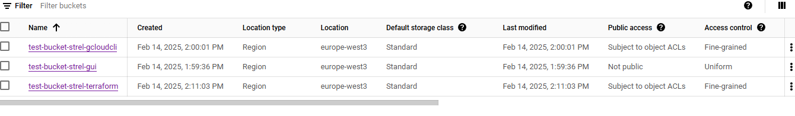
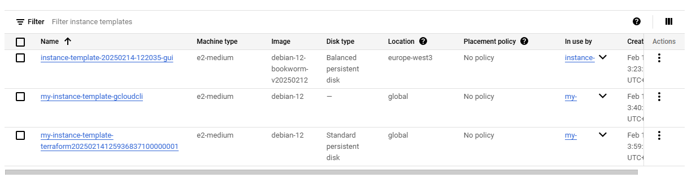
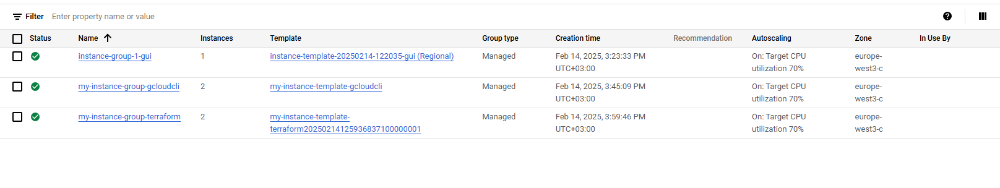

<h1 align="center"> Задание:</h1>

1. Создайте новый бакет Amazon S3/GCP Cloud Storage тремя способами: через GUI (консоль в браузере), с помощью CLI, конфиг в terraform.

2. Создайте Amazon EC2/GCP Compute Engine и настройте масштабирование, чтобы автоматически добавлять новые экземпляры в случае увеличения нагрузки. Сделайте это тремя способами:  через GUI (консоль в браузере) с помощью CLI, конфиг в terraform.

3. *Создайте базу через GUI (консоль в браузере), с помощью CLI, конфиг в terraform данных Amazon RDS/GCP CloudSQL и подключитесь к ней из виртуальной машины, которую вы создали ранее. Сделайте это тремя способами:  через GUI (консоль в браузере) с помощью CLI, конфиг в terraform.

 <h1 align="center"> Выполнение:</h1>

 1. Так как у меня доступ только к GCP, то все задания будут выполняться там.
   
        Для того, чтобы создать бакет через GUI перехожу на веб страницу облака, в поиске пишу "Buckets" -> "Create bucket". Выбираю регион eu-west3, тип бакета стандарт, остальыне настройки оставляю по умолчанию, в итоге бакет создается.
    

    Для того, чтобы создать бакет через gcloud cli, необходимо поставить тулу, следуя инструкции https://cloud.google.com/sdk/docs/install#deb

        sudo apt-get update

        sudo apt-get install apt-transport-https ca-certificates gnupg curl

        curl https://packages.cloud.google.com/apt/doc/apt-key.gpg | sudo gpg --dearmor -o /usr/share/keyrings/cloud.google.gpg

        echo "deb [signed-by=/usr/share/keyrings/cloud.google.gpg] https://packages.cloud.google.com/apt cloud-sdk main" | sudo tee -a /etc/apt/sources.list.d/google-cloud-sdk.list

        sudo apt-get update && sudo apt-get install google-cloud-cli

        Далее запускаю: gcloud init
        
        Далее необходимо авторизоваться. В веб версии облака захожу в раздел IAM Admins, создаю ключ для сервисного аккаунта, далее ключ автоматически скачивается в формате json. 

        gcloud auth activate-service-account --key-file=/path/to/your-key.json #авторизовываюсь по ключу, указывая его путь и имя.

        gcloud auth list  #убеждаюсь что авторизация прошла успешно.

        gcloud config set project YOUR_PROJECT_ID #Устанавливаю проект по умолчанию

        Далее создаю бакет.

        gsutil mb -l europe-west3 gs://test-bucket-strel-gcloudcli/

        Бакет создан.

    Для того, чтобы создать бакет через terraform:

        Создаю файл main.tf в который помещаю следующий код:

            provider "google" {
            credentials = file("/mnt/d/git/Artiom_Strelchenko_DOS23/Homework_Lesson35_Clouds_1_HM28/turing-bebop-450119-g5-75a718581401.json")
            project = "turing-bebop-450119-g5"
            region  = "europe-west3"
            }

            resource "google_storage_bucket" "my_bucket" {
            name          = "test-bucket-strel-terraform"
            location      = "europe-west3"
            storage_class = "STANDARD"

            versioning {
                enabled = true
            }
            }

            Указываю провайдер, путь к сервисному ключу для terraform, указываю название проекта и регион. Название бакета и класс.

            Terraform init

            Terraform has been successfully initialized!

            You may now begin working with Terraform. Try running "terraform plan" to see
            any changes that are required for your infrastructure. All Terraform commands
            should now work.

            If you ever set or change modules or backend configuration for Terraform,
            rerun this command to reinitialize your working directory. If you forget, other
            commands will detect it and remind you to do so if necessary.

            terraform apply

                        Terraform used the selected providers to generate the following execution plan. Resource actions are indicated with the following symbols:
            + create

            Terraform will perform the following actions:

            # google_storage_bucket.my_bucket will be created
            + resource "google_storage_bucket" "my_bucket" {
                + effective_labels            = {
                    + "goog-terraform-provisioned" = "true"
                    }
                + force_destroy               = false
                + id                          = (known after apply)
                + location                    = "EUROPE-WEST3"
                + name                        = "test-bucket-strel-terraform"
                + project                     = (known after apply)
                + project_number              = (known after apply)
                + public_access_prevention    = (known after apply)
                + rpo                         = (known after apply)
                + self_link                   = (known after apply)
                + storage_class               = "STANDARD"
                + terraform_labels            = {
                    + "goog-terraform-provisioned" = "true"
                    }
                + uniform_bucket_level_access = (known after apply)
                + url                         = (known after apply)

                + soft_delete_policy (known after apply)

                + versioning {
                    + enabled = true
                    }

                + website (known after apply)
                }

            Plan: 1 to add, 0 to change, 0 to destroy.

            Do you want to perform these actions?
            Terraform will perform the actions described above.
            Only 'yes' will be accepted to approve.

            Enter a value: yes

            google_storage_bucket.my_bucket: Creating...
            google_storage_bucket.my_bucket: Creation complete after 3s [id=test-bucket-strel-terraform]

            Apply complete! Resources: 1 added, 0 changed, 0 destroyed.

    По итогу созданы три бакета тремя способами.
    

    Создаю файл .gitignore, в который помещаю название json файл с сервисным ключом.

1.  Для того, чтобы создать группу инстансов через GUI, которая масштабируется в зависимости от нагрузки:

        Захожу во вкладку Instance groups, где создаю новую группу. 
        Ввожу ее название. Создаю темлплейт и подкидываю его к группе инстансов. Включаю автоскелинг, минимум 1 и максимум 3 машины.
        Выбираю параметр загрузки цп > 70%, при котором происходит масштабирование.
        Группа автоматически масштабируемых инстансов готова.

    Для того, чтобы создать группу инстансов через gcloud cli:

        У меня уже установлена gcloud cli поэтому ввожу следующие команды: создаю новый теймплейт

        gcloud compute instance-templates create my-instance-template-gcloudcli \
        --machine-type=e2-medium \
        --image-family=debian-12 \
        --image-project=debian-cloud 

        Создаю управляемую группу инстансов:

        gcloud compute instance-groups managed create my-instance-group-gcloudcli \
        --base-instance-name=my-instance \
        --size=2 \
        --template=my-instance-template-gcloudcli \
        --zone=europe-west3-c

        Вывод:

        Created [https://www.googleapis.com/compute/v1/projects/turing-bebop-450119-g5/zones/europe-west3-c/instanceGroupManagers/my-instance-group-gcloudcli].
        NAME                         LOCATION        SCOPE  BASE_INSTANCE_NAME  SIZE  TARGET_SIZE  INSTANCE_TEMPLATE               AUTOSCALED
        my-instance-group-gcloudcli  europe-west3-c  zone   my-instance         0     2            my-instance-template-gcloudcli  no

        Настраиваю автоматическое масштабирование:

        gcloud compute instance-groups managed set-autoscaling my-instance-group-gcloudcli \
        --zone=europe-west3-c \
        --max-num-replicas=5 \
        --min-num-replicas=2 \
        --target-cpu-utilization=0.7

        Вывод:

        Created [https://www.googleapis.com/compute/v1/projects/turing-bebop-450119-g5/zones/europe-west3-c/autoscalers/my-instance-group-gcloudcli-wtlr].
        ---
        autoscalingPolicy:
        coolDownPeriodSec: 60
        cpuUtilization:
            utilizationTarget: 0.7
        maxNumReplicas: 5
        minNumReplicas: 2
        mode: ON
        creationTimestamp: '2025-02-14T04:48:05.689-08:00'
        id: '5969041123249915242'
        kind: compute#autoscaler
        name: my-instance-group-gcloudcli-wtlr
        selfLink: https://www.googleapis.com/compute/v1/projects/turing-bebop-450119-g5/zones/europe-west3-c/autoscalers/my-instance-group-gcloudcli-wtlr
        status: ACTIVE
        target: https://www.googleapis.com/compute/v1/projects/turing-bebop-450119-g5/zones/europe-west3-c/instanceGroupManagers/my-instance-group-gcloudcli
        zone: https://www.googleapis.com/compute/v1/projects/turing-bebop-450119-g5/zones/europe-west3-c

    Автоматически масштабируемая группа инстансов создана и настроена через gcloud cli.

    Для создания группы инстансов через terraform создаю main.tf, в который помещаю следующий код:

            provider "google" {
            credentials = file("/mnt/d/git/Artiom_Strelchenko_DOS23/Homework_Lesson35_Clouds_1_HM28/turing-bebop-450119-g5-75a718581401.json")
            project = "turing-bebop-450119-g5"
            region  = "europe-west3-c"
            }

            resource "google_compute_instance_template" "default" {
            name_prefix  = "my-instance-template-terraform"
            machine_type = "e2-medium"

            disk {
                source_image = "debian-cloud/debian-12"
            }

            network_interface {
                network = "default"
            }

            }

            resource "google_compute_instance_group_manager" "default" {
            name               = "my-instance-group-terraform"
            base_instance_name = "my-instance"
            zone               = "europe-west3-c"

            version {
                instance_template = google_compute_instance_template.default.self_link
            }

            target_size = 2
            }

            resource "google_compute_autoscaler" "default" {
            name   = "my-autoscaler"
            zone   = "europe-west3-c"
            target = google_compute_instance_group_manager.default.self_link

            autoscaling_policy {
                max_replicas    = 5
                min_replicas    = 2
                cpu_utilization {
                target = 0.7
                }
            }
            }

            Здесь описываю провайдер, создаю теймплейт, группу инстансов и настраиваю автоматическое масштабирование.
        
    Результат команды terraform init

            Initializing the backend...
            Initializing provider plugins...
            - Reusing previous version of hashicorp/google from the dependency lock file
            - Using previously-installed hashicorp/google v6.20.0

            Terraform has been successfully initialized!

            You may now begin working with Terraform. Try running "terraform plan" to see
            any changes that are required for your infrastructure. All Terraform commands
            should now work.

            If you ever set or change modules or backend configuration for Terraform,
            rerun this command to reinitialize your working directory. If you forget, other
            commands will detect it and remind you to do so if necessary.

    Результат команды terraform apply

            Terraform used the selected providers to generate the following execution plan. Resource actions are indicated with the following symbols:
              + create

            Terraform will perform the following actions:

              # google_compute_autoscaler.default will be created
              + resource "google_compute_autoscaler" "default" {
                  + creation_timestamp = (known after apply)
                  + id                 = (known after apply)
                  + name               = "my-autoscaler"
                  + project            = "turing-bebop-450119-g5"
                  + self_link          = (known after apply)
                  + target             = (known after apply)
                  + zone               = "europe-west3-c"

                  + autoscaling_policy {
                      + cooldown_period = 60
                      + max_replicas    = 5
                      + min_replicas    = 2
                      + mode            = "ON"

                      + cpu_utilization {
                          + predictive_method = "NONE"
                          + target            = 0.7
                        }
                    }
                }

              # google_compute_instance_group_manager.default will be created
              + resource "google_compute_instance_group_manager" "default" {
                  + base_instance_name             = "my-instance"
                  + creation_timestamp             = (known after apply)
                  + fingerprint                    = (known after apply)
                  + id                             = (known after apply)
                  + instance_group                 = (known after apply)
                  + instance_group_manager_id      = (known after apply)
                  + list_managed_instances_results = "PAGELESS"
                  + name                           = "my-instance-group-terraform"
                  + operation                      = (known after apply)
                  + project                        = "turing-bebop-450119-g5"
                  + self_link                      = (known after apply)
                  + status                         = (known after apply)
                  + target_size                    = 2
                  + target_stopped_size            = (known after apply)
                  + target_suspended_size          = (known after apply)
                  + wait_for_instances             = false
                  + wait_for_instances_status      = "STABLE"
                  + zone                           = "europe-west3-c"

                  + instance_lifecycle_policy (known after apply)

                  + standby_policy (known after apply)

                  + update_policy (known after apply)

                  + version {
                      + instance_template = (known after apply)
                    }
                }

              # google_compute_instance_template.default will be created
              + resource "google_compute_instance_template" "default" {
                  + can_ip_forward       = false
                  + creation_timestamp   = (known after apply)
                  + effective_labels     = {
                      + "goog-terraform-provisioned" = "true"
                    }
                  + id                   = (known after apply)
                  + machine_type         = "e2-medium"
                  + metadata_fingerprint = (known after apply)
                  + name                 = (known after apply)
                  + name_prefix          = "my-instance-template-terraform"
                  + project              = "turing-bebop-450119-g5"
                  + region               = (known after apply)
                  + self_link            = (known after apply)
                  + self_link_unique     = (known after apply)
                  + tags_fingerprint     = (known after apply)
                  + terraform_labels     = {
                      + "goog-terraform-provisioned" = "true"
                    }

                  + confidential_instance_config (known after apply)

                  + disk {
                      + auto_delete            = true
                      + boot                   = (known after apply)
                      + device_name            = (known after apply)
                      + disk_size_gb           = (known after apply)
                      + disk_type              = (known after apply)
                      + interface              = (known after apply)
                      + mode                   = (known after apply)
                      + provisioned_iops       = (known after apply)
                      + provisioned_throughput = (known after apply)
                      + source_image           = "debian-cloud/debian-12"
                      + type                   = (known after apply)
                    }

                  + network_interface {
                      + internal_ipv6_prefix_length = (known after apply)
                      + ipv6_access_type            = (known after apply)
                      + ipv6_address                = (known after apply)
                      + name                        = (known after apply)
                      + network                     = "default"
                      + stack_type                  = (known after apply)
                      + subnetwork                  = (known after apply)
                      + subnetwork_project          = (known after apply)
                    }

                  + scheduling (known after apply)
                }

            Plan: 3 to add, 0 to change, 0 to destroy.

            Do you want to perform these actions?
              Terraform will perform the actions described above.
              Only 'yes' will be accepted to approve.

              Enter a value: yes

            google_compute_instance_template.default: Creating...
            google_compute_instance_template.default: Creation complete after 3s [id=projects/turing-bebop-450119-g5/global/instanceTemplates/my-instance-template-terraform20250214125936837100000001]
            google_compute_instance_group_manager.default: Creating...
            google_compute_instance_group_manager.default: Still creating... [11s elapsed]
            google_compute_instance_group_manager.default: Still creating... [21s elapsed]
            google_compute_instance_group_manager.default: Creation complete after 23s [id=projects/turing-bebop-450119-g5/zones/europe-west3-c/instanceGroupManagers/my-instance-group-terraform]
            google_compute_autoscaler.default: Creating...
            google_compute_autoscaler.default: Creation complete after 1s [id=projects/turing-bebop-450119-g5/zones/europe-west3-c/autoscalers/my-autoscaler]

            Apply complete! Resources: 3 added, 0 changed, 0 destroyed.
    
    Теймплейты:

    

    Группы инстансов:

    

