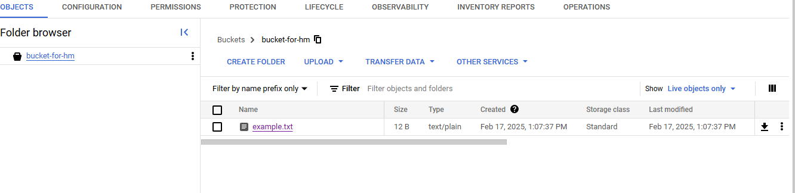

<h1 align="center"> Задание:</h1>

1. Создайте экземпляр EC2/CE и прикрепите к нему EBS-том/SSD. На выбор terraform, cli, python boto3, python google
2. Настройте доступ к экземпляру через SSH. Доступ должен работать с вашего хоста.
3. Создайте бакет Amazon S3 и загрузите в него несколько файлов. На выбор terraform, cli, python boto3, python google
4. *Создайте экземпляр базы данных RDS/CloudSQL и настройте доступ к нему.
5. *Создайте резервную копию базы данных и восстановите ее на новый
экземпляр RDS

 <h1 align="center"> Выполнение:</h1>

 1. Работаю с GCP, поэтому буду создавать через CE и аттачить SSD. Попробую сделать через python скрипт с ипользовальнием зависимостей от google.

        Для начала создам новое окружение python для загрузки модулей google и загружу их:

        python3 -m venv myenv
        source myenv/bin/activate
        pip install google-cloud-compute google-cloud-storage

    Логинюсь в GCP:

        gcloud auth application-default login

        Тут перехожу по ссылке и логинюсь.
    
    Далее создаю файл instance-create.py, в который вставляю следующий скрипт:

        from google.cloud import compute_v1

        project_id = "turing-bebop-450119-g5"
        zone = "europe-west3-a"
        instance_name = "instance-for-hm"

        def create_instance():
            instances_client = compute_v1.InstancesClient()

            instance = compute_v1.Instance()
            instance.name = instance_name
            instance.machine_type = f"zones/{zone}/machineTypes/e2-micro"
            
            disk = compute_v1.AttachedDisk()
            disk.initialize_params = compute_v1.AttachedDiskInitializeParams(
                disk_name="my-ssd",
                source_image="projects/debian-cloud/global/images/family/debian-12",
                disk_size_gb=50,
                disk_type=f"zones/{zone}/diskTypes/pd-ssd"
            )
            disk.boot = True
            instance.disks = [disk]

            instance.network_interfaces = [
                compute_v1.NetworkInterface(
                    name="global/networks/default"
                )
            ]

            operation = instances_client.insert(
                project=project_id, zone=zone, instance_resource=instance
            )
            operation.result()
            print(f"Instance {instance_name} created.")

        create_instance()

    Здесь указываю ID проекта, зону, навзание машины, какую машину создавать и какой диск аттачить.

    Запускаю скрипт

            python instance-create.py
            Instance instance-for-hm created.
    Инстанс создан.

 2. Для доступа по SSH к инстансу с хоста использую внутреннюю команду gcloud.

            gcloud ssh instance-for-hm --zone=europe-west3-a

            Создается пара ключей.
            Далее варнинги о том, что лучше использовать встроенное от платформы по ssh веб подключение.
            В конечном итоге я подключился.

            Last login: Mon Feb 17 09:56:14 2025 from 35.235.241.242
            wsl@instance-for-hm:~$
1. Для создания бакета создаю файл bucket-create.py.
    Предварительно создаю txt файл в текущей директории:

        echo "Hello, GCP!" > example.txt
    
    Код скрипта для создания бакета:

        from google.cloud import storage

        bucket_name = "bucket-for-hm"

        def create_bucket():
            storage_client = storage.Client()
            bucket = storage_client.bucket(bucket_name)
            bucket.storage_class = "STANDARD"
            storage_client.create_bucket(bucket, location="EU")
            print(f"Bucket {bucket_name} created.")

        def upload_file(file_name):
            storage_client = storage.Client()
            bucket = storage_client.bucket(bucket_name)
            blob = bucket.blob(file_name)
            blob.upload_from_filename(file_name)
            print(f"Uploaded {file_name} to {bucket_name}.")

        create_bucket()
        upload_file("example.txt")

    Здесь описываю название, тип бакета, локацию. Помещаю в него example.txt

        