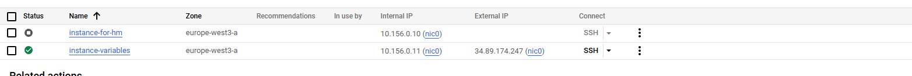

<h1 align="center"> Задание:</h1>
 
1. Напишите конфиг для создания EC2/CE.
2. Добавьте переменную, которая будет определять имя вашей виртуальной машины.

 <h1 align="center"> Выполнение:</h1>

Для создания инстанся в GPC создаю main.tf и добавляюю следующий код:

        provider "google" {
        project = "turing-bebop-450119-g5"
        region  = "europe-west3"
        zone    = "europe-west3-a"
        }

        resource "google_compute_instance" "vm_instance" {
        name         = var.vm_name 
        machine_type = "e2-micro"
        zone         = "europe-west3-a"

        boot_disk {
            initialize_params {
            image = "debian-12-bookworm-v20250212" 
            }
        }

        network_interface {
            network = "default"
            access_config {
            }
        }

        }

        output "vm_name" {
        value = google_compute_instance.vm_instance.name
        }

Здесь строка name = var.vm_name содержит переменную, которая указывается в файле variables.tf

В конце вывожу аутпут по vm_instance.name

Так же создаю файл variables.tf в который добавляю:

        variable "vm_name" {
        description = "The name of the virtual machine"
        type        = string
        default     = "instance-variables"
}

Далее инициализирую проект:

        terraform init

        Initializing the backend...
        Initializing provider plugins...
        - Finding latest version of hashicorp/google...
        - Installing hashicorp/google v6.20.0...
        - Installed hashicorp/google v6.20.0 (signed by HashiCorp)
        Terraform has created a lock file .terraform.lock.hcl to record the provider
        selections it made above. Include this file in your version control repository
        so that Terraform can guarantee to make the same selections by default when
        you run "terraform init" in the future.

        Terraform has been successfully initialized!

        You may now begin working with Terraform. Try running "terraform plan" to see
        any changes that are required for your infrastructure. All Terraform commands
        should now work.

        If you ever set or change modules or backend configuration for Terraform,
        rerun this command to reinitialize your working directory. If you forget, other
        commands will detect it and remind you to do so if necessary.

И применяю

        terraform apply

        Apply complete! Resources: 1 added, 0 changed, 0 destroyed.

        Outputs:
        vm_name = "instance-variables"

В конце получаю строку вывода, которую описывал в main.tf.
